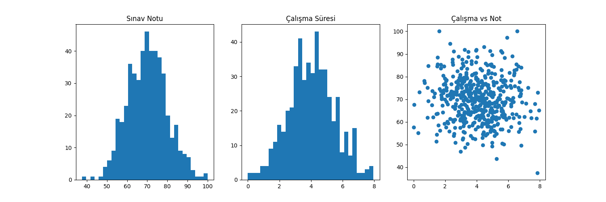

# Öğrenci Veri Analizi Projesi

## 📌 Proje Hakkında
Bu projede Python kullanılarak 500 öğrenciden oluşan sentetik bir veri seti oluşturulmuştur.  
Oluşturulan veriler, gerçek hayattaki dağılımları taklit edecek şekilde normal dağılıma uygun olarak üretilmiştir.

Veri seti daha sonra matplotlib kütüphanesi kullanılarak görselleştirilmiş ve analiz edilmiştir.

---

## 📊 Veri Seti Açıklaması

Veri seti toplam 500 gözlem ve 3 sütundan oluşmaktadır:

1. **id**  
   - 1’den 500’e kadar benzersiz kimlik numarası

2. **sinav_notu**  
   - 0 ile 100 arasında değerler  
   - Normal dağılıma uygun (çoğunluk orta seviyede)

3. **calisma_suresi**  
   - Günlük çalışma süresi (saat)  
   - Normal dağılıma uygun değerler

---

## 🛠 Kullanılan Teknolojiler
- Python  
- pandas  
- matplotlib  

---

## 📈 Grafikler

---

## 🔍 Analiz ve Yorum

- Sınav notları ve çalışma süreleri normal dağılım (çan eğrisi) göstermektedir.  
- Veriler incelendiğinde, öğrencilerin büyük bir kısmının ortalama değerler etrafında toplandığı görülmektedir.  
- Çalışma süresi ile sınav notu arasında belirli bir ilişki gözlemlenebilir.  

---

## 🎯 Sonuç

Bu proje, sentetik veri üretimi, veri görselleştirme ve temel veri analizi konularını uygulamalı olarak göstermektedir.  
Gerçek dünya verilerine benzer yapılar oluşturularak analiz süreçleri simüle edilmiştir.
